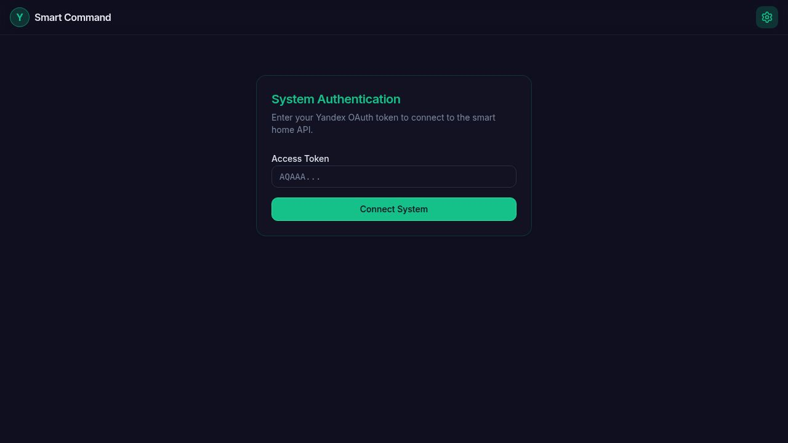

# Yandex Smart Dashboard

Веб-панель управления устройствами умного дома через API Яндекс Умного дома (Yandex IoT). Два режима: **инженерная панель** для полного управления и **пользовательская панель** — плиточный дашборд в стиле iOS.



## Возможности

- **Инженерная панель** (`/`) — домохозяйства, комнаты, карточки устройств (вкл/выкл, яркость, показания датчиков), поиск, запуск сценариев, статус подключения.
- **Пользовательская панель** (`/panel/:householdId`) — виджет погоды, переключение комнат, адаптивная сетка плиток (2–5 колонок), слайдеры яркости, SVG-спарклайны датчиков, режим редактирования (drag-and-drop, закрепление, скрытие, изменение размера).
- **Погода** — данные из Open-Meteo, название города через reverse-geocoding (Nominatim).
- **Сценарии** — запуск пользовательских сценариев Яндекс Умного дома.

## Стек

| Слой | Технологии |
|------|------------|
| Фронтенд | React, Vite, TanStack Query, Wouter, shadcn/ui, Tailwind CSS, TypeScript |
| Бэкенд | Express 5 — CORS-прокси к Yandex IoT и Open-Meteo |
| Типы и валидация | Zod, OpenAPI, кодогенерация (Orval) |
| Монорепозиторий | pnpm workspaces, Node.js 24 |

## Архитектура

- Все запросы к Яндекс API идут через бэкенд-прокси; заголовок `x-yandex-token` пробрасывается как `Authorization: Bearer <token>`.
- Бэкенд не хранит данные — персистентность на стороне клиента (`localStorage`): токен, конфигурация панели, история показаний датчиков.
- Контракт API описан в `lib/api-spec/openapi.yaml` (источник истины), клиентские хуки и Zod-схемы генерируются автоматически.

## Структура

```
artifacts/api-server/      # Express-прокси к Yandex IoT и Open-Meteo
artifacts/smart-home/      # React-приложение (инженерная и пользовательская панели)
lib/api-spec/              # OpenAPI-контракт
lib/api-client-react/      # Сгенерированные React Query хуки
lib/api-zod/               # Сгенерированные Zod-схемы
```

## Запуск

```bash
pnpm install
pnpm --filter @workspace/api-server run dev   # API-прокси
pnpm --filter @workspace/smart-home run dev   # фронтенд
```

## Что демонстрирует проект

- проектирование интеграции с внешним REST API;
- CORS-прокси и безопасная работа с токенами;
- описание контракта API (OpenAPI) и генерацию клиента;
- построение UI и пользовательских сценариев;
- работу в монорепозитории.
